  

 

### `> tech_stack`

  

 

### `> github_stats`

  
  

 

### `> contact`

<pre>
github    @beatof1l
telegram  @beatof1l
</pre>

 

### `> contributions`

  <picture>
    <source
      media="(prefers-color-scheme: dark)"
      srcset="https://raw.githubusercontent.com/beatof1l/beatof1l/gh-pages/github-snake-dark.svg"
    />
    <source
      media="(prefers-color-scheme: light)"
      srcset="https://raw.githubusercontent.com/beatof1l/beatof1l/gh-pages/github-snake.svg"
    />
    
  </picture>

